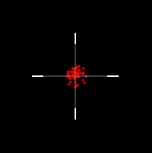

# Cycler Rifle Accuracy

# Process
  1. I went into a game and lined up the shots: 
  
  
  
  2. I shot ca. 50 times with the cycler and took pictures.
  
  3. I created a Photoshop file and drew dots where the bullets had hit.
  
# Conclution
This is not a lot of data, but I think we can get a pretty good understanding and see that the cycler rifle is pretty accurate. I also tested with jumping and walking and I didn't seem to get any different resoults. Which is good to know. It can look like the shots tend to hit above the hitmarker, but I think that is just a statistical deviation, and if we add more data it will go away. Under is all the files if you want to take a look at what I have done. 

[Pictures and Photoshop file](https://github.com/Nikolai-Borbe/Cycler-Rifle-Accuracy/releases/tag/v1.0.1)
